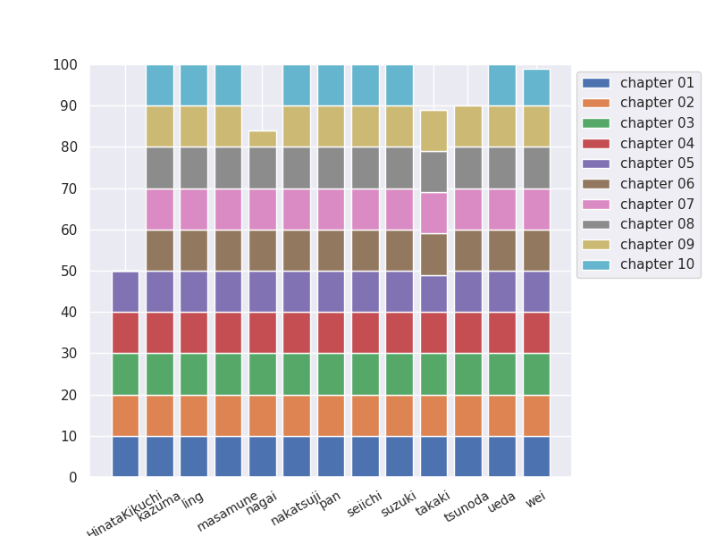

[](https://github.com/tmu-nlp/100knock2021/actions/workflows/update-progress.yml)

# 100knock2021

小町研2021年度新入生向け勉強会として、言語処理100本ノックに取り組みます。  
教材URL: https://nlp100.github.io/ja/

毎週1章分（10問）解いてください。  
勉強会のときに1人1問ずつ自分のコードを説明してもらいます。  

## usage

初回はこのレポジトリを clone してください。

```
$ git clone https://github.com/tmu-nlp/100knock2021.git
```

コードを書いたら remote repository に push してください。
チャプター名、ファイル名はすべて二桁の数字にしてください（例: `chapter01`, `knock00.py`）。
```
$ git pull
$ git add ./<user_name>/chapter##/knockXX.py
$ git commit -m 'your message'
$ git push origin main
```

## 注意事項

新入生はできるだけ Python3 系で書いてください。
わからないところは**積極的**に TA か研究室の人に聞いてください。
**他の人のディレクトリを変更することは絶対にやめてください。**
（他の人のコードを閲覧したい場合は、Web サイト上から閲覧してください。）
chapter##/knockXX.py のフォルダ名とファイル名を間違えると進捗グラフに反映されません。

## みんなの進捗




# 100knock2021 (English) 

We will work NLP 100 knockings as the study meeting for the newcomers in 2021. 
Let's solve the 10 questions every week.
TA and participants review your code.  

You should clone this repository the first time.
```
$ git clone https://github.com/tmu-nlp/100knock2021.git
```

"##" and "XX" mean "two-digit question number". (e.g. `chapter01`, `knock00.py`)
```
$ git pull
$ git add ./<user_name>/chapter##/knockXX.py
$ git commit -m 'your message'
$ git push origin main
```

## Notes

Please use Python3.  
Please ask TA's helps **positively**.  
Please commit your script and picture only. (Don't commit the other files such as text file because file size of the output will be gradually larger.)  
**Don't change the others' directories.**  
Teaching materials of this meeting are written in Japanese, so some participants need to translate them.
